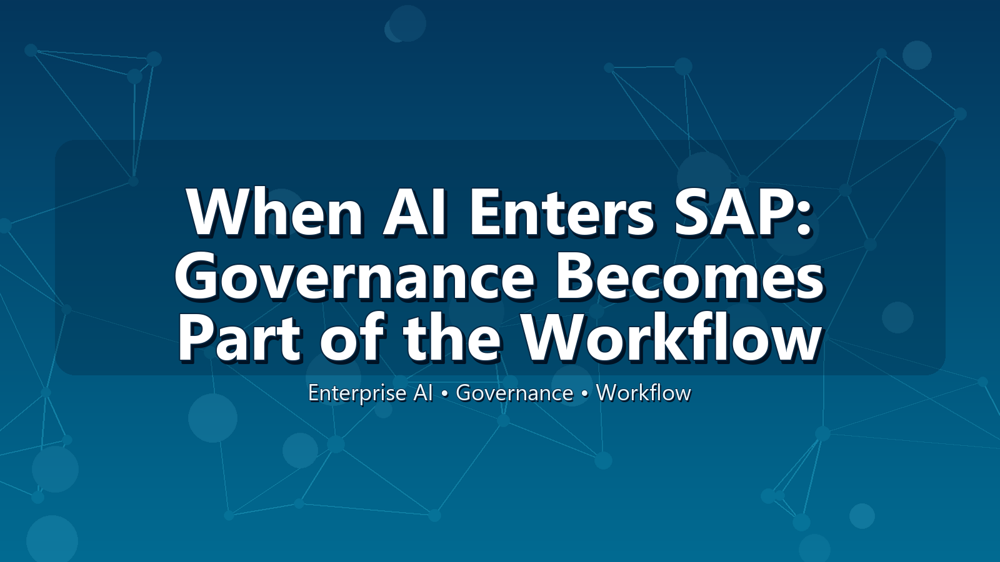
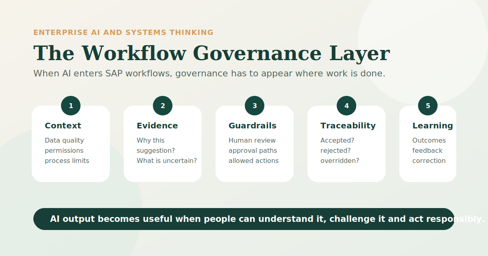

# When AI Enters SAP, Governance Becomes Part of the Workflow

Why enterprise AI cannot be treated as a side experiment once it starts shaping daily decisions

Veera Babu Tiragatla &middot; 8 minute read

<figure class="article-figure">
  
  <figcaption>When AI enters the flow of enterprise work, governance has to move from policy into the moment of action.</figcaption>
</figure>

AI in SAP should not be judged only by whether it can generate an answer.

That is the easy part to admire.

The harder question begins when the answer appears inside a real workflow.

A finance user sees a suggested exception. A planner receives a recommended adjustment. A procurement team is nudged toward a supplier. A manager reads a summary that sounds complete. A service team is guided toward the next action.

In enterprise systems, the dangerous moment is not always when technology fails. Sometimes it is when the system works just well enough for people to trust it too quickly.

At that point, AI is no longer just a technology demonstration.

It has entered the operating rhythm of the organisation.

And once AI enters the workflow, governance cannot remain somewhere else.

## AI inside SAP is not the same as AI in a sandbox

Many organisations first encounter generative AI as a separate tool. Someone asks a question, receives a response, checks it, edits it and decides what to do next. The risks are still real, but the tool often sits outside the formal flow of business execution.

SAP is different.

SAP systems sit close to money, people, procurement, inventory, assets, planning, compliance and customer commitments. They do not merely hold information. They support transactions, approvals, exceptions, controls and operational decisions.

That changes the meaning of enterprise AI.

When AI is used in a sandbox, it can be treated as assistance. When AI appears inside a business process, it becomes part of the control environment.

This distinction matters.

An AI-generated summary in isolation may be helpful. The same summary inside a finance, HR, procurement or supply-chain workflow may influence a decision that carries financial, legal, ethical or operational consequences.

So the question is not only:

> Can the model produce a useful output?

It is also:

> What happens when a person relies on that output inside a live enterprise process?

That is where governance becomes serious.

## Paper governance is not enough

Most organisations already understand that AI requires governance. They talk about policies, risk frameworks, model approvals, data privacy, security, documentation and compliance.

These are necessary.

But they are not enough if they remain too far from the moment of action.

This is not an argument against governance documents. They matter. But I have seen enough enterprise change to know that a control written in a framework does not automatically become a control people can use at 10:17 on a Tuesday morning when work is moving, pressure is real and the system sounds confident.

A policy document does not help much if the user cannot see why an AI suggestion appeared. A steering committee cannot review every small recommendation made inside a daily process. A model-risk framework cannot carry accountability by itself if the business process does not show who reviewed, accepted, rejected or overrode the suggestion.

The real test is simple:

When someone is working inside the system, does governance appear at the point of action?

Can the person see:

- what data influenced the suggestion;
- what assumption may be embedded in it;
- what uncertainty remains;
- what action is allowed;
- what requires approval;
- what must stay human-owned;
- what will be logged after action is taken?

If the answer is no, then governance exists somewhere in the organisation, but not necessarily where the decision is being shaped.

That gap is dangerous because enterprise AI is becoming more fluent, more embedded and more confident in presentation. A recommendation that sounds complete can make uncertainty feel smaller than it is.

The user may not be ignoring governance.

They may simply not be able to see it at the moment they need it.

## SAP AI makes accountability harder to hide

Enterprise systems have always distributed responsibility across roles, controls and workflows. An invoice is posted or blocked. A purchase order is released or rejected. A role allows an action or it does not.

AI changes the texture of that environment. It introduces probabilistic suggestions into systems that were historically governed through more deterministic controls.

That sounds abstract until it lands in a real process.

If an AI assistant recommends an action, who is responsible for the result?

The user who accepted it?

The process owner who allowed that recommendation to appear?

The data owner whose data shaped the output?

The governance team that approved the use case?

The technology team that configured the integration?

The vendor that provided the capability?

In practice, responsibility cannot be left as a philosophical question. Someone will live with the outcome. Someone will explain it. Someone will be asked why the system was trusted.

So responsibility has to be designed.

For example, consider a procurement scenario. An AI-enabled workflow may recommend a supplier action based on price, delivery history and risk indicators. That sounds efficient. But what if the recommendation does not fully expose a sustainability concern, a regional compliance issue or a dependency risk that matters to the organisation?

The problem is not simply that AI could be wrong.

The deeper problem is that people may not know what kind of wrongness to look for.

This is why enterprise AI governance must include more than approval to use a tool. It must shape the conditions under which people understand and act on AI output.

## Governance has to become visible where people act

The practical design challenge is to bring governance closer to the workflow without overwhelming the user.

If every AI suggestion is surrounded by pages of risk language, people will ignore it. If there is no visible governance at all, people may over-trust the output.

The goal is usable governance: enough context to slow down blind trust, but not so much friction that people work around the system.

For AI-enabled SAP workflows, I think of this as a **Workflow Governance Layer**.

It has five moments.

<figure class="article-figure">
  
  <figcaption>The Workflow Governance Layer: context before the suggestion, evidence at the suggestion, guardrails before action, traceability after action and feedback during learning.</figcaption>
</figure>

### 1. Before the suggestion: context

Before AI recommends anything, the system should know the boundaries of the use case.

Which data is allowed? Which roles can see it? Which business rules apply? Which regulatory or organisational limits matter? Which parts of the process are advisory, and which are controlled?

Governance begins before the user sees the answer.

### 2. At the suggestion: evidence

When the recommendation appears, the person should not receive only a polished answer.

They should receive enough context to judge it.

That may include the basis for the suggestion, the relevant exception, the key evidence, a confidence indicator, an explanation of limits or a warning that human review is required.

The point is not to expose every technical detail.

The point is to make trust inspectable.

### 3. Before the action: guardrails

Some actions should be suggested but not executed automatically. Some should require approval. Some should be blocked. Some should be escalated.

This is where governance becomes operational.

The system should help people understand not only what AI suggests, but what the organisation permits.

### 4. After the action: traceability

Once a user accepts, rejects or overrides an AI recommendation, the outcome should not disappear.

The organisation should be able to see what happened:

- What was suggested?
- Who reviewed it?
- What action was taken?
- Was the recommendation overridden?
- Was the outcome later confirmed or corrected?

Without traceability, learning becomes anecdotal.

### 5. During learning: feedback

AI-enabled workflows should improve not only by model updates, but by organisational learning.

If users repeatedly override a recommendation, that is a signal. If a recommendation improves speed but creates downstream rework, that is a signal. If the system performs well for one region but poorly for another, that is a signal.

Governance should not only prevent harm.

It should help the organisation learn where its assumptions are wrong.

## Use cases are not enough

A common way to discuss AI in SAP is to list use cases: finance, procurement, HR, supply chain, sales, service, planning and so on.

Use cases are helpful, but they are not the whole conversation.

The more important question is what kind of decision or action the AI output influences.

In finance, AI may help detect anomalies or summarise cash-flow patterns. The governance question is whether the user can understand why something was flagged and what action is appropriate.

In procurement, AI may help evaluate supplier risk or suggest contract actions. The governance question is whether compliance, dependency, sustainability and commercial trade-offs remain visible.

In supply chain, AI may recommend a planning adjustment. The governance question is who owns the consequence if the recommendation improves one metric while damaging another.

In HR, AI may summarise talent, performance or workforce information. The governance question is whether the output is fair, explainable and limited to appropriate use.

The same AI capability can be low-risk in one workflow and high-risk in another.

That is why governance cannot be generic.

It must understand the process.

## The practical test before embedding AI into a SAP workflow

Before introducing AI into an enterprise workflow, I would ask seven questions.

1. **What exact decision or action does this AI output influence?**

If the answer is vague, the governance will be vague too.

2. **What data and business context does it rely on?**

A recommendation is only as trustworthy as the context behind it.

3. **What assumption could be wrong?**

Every model, rule, summary or recommendation carries assumptions. The dangerous ones are often invisible.

4. **What should the user see before trusting it?**

Not every detail is useful. But some evidence, limitation or warning may be essential.

5. **What must remain explicitly human-owned?**

Automation should not quietly erase accountability.

6. **What gets logged when the suggestion is accepted, rejected or overridden?**

If the organisation cannot inspect the decision trail, it cannot learn from it.

7. **How will we know whether the AI improved the decision?**

Speed is not enough. The outcome matters.

These questions shift the discussion from "Can we use AI here?" to "Can we use AI responsibly here?"

That is a more mature enterprise conversation.

## The real promise is not automation alone

AI will continue to become more embedded in enterprise software. Assistants, agents, process recommendations and automated actions will increasingly appear inside the systems people already use.

That future can be useful.

But it will not become useful simply because the answers are faster, the interface is smoother or the model is more fluent.

It becomes useful when people can understand the evidence, challenge the suggestion, see the limits and act with responsibility.

For years, enterprise systems were designed to record, integrate and automate business activity. Now they are beginning to participate more directly in how people interpret situations and decide what to do. That is a serious shift. It should make us more thoughtful, not merely more excited.

That makes governance more important, not less.

In the next generation of SAP environments, governance should not be a layer added after innovation.

It should be part of how work is done.

---

**Further context:** SAP describes Joule and SAP Business AI as embedded across enterprise workflows, business data and process context, with emphasis on security, governance and compliance. SAP also frames RISE with SAP around cloud ERP modernization, AI assistants, governed extensibility and value-driven transformation. This article uses those themes as context, but the argument is my own: governance has to be designed into the moment where people act.
